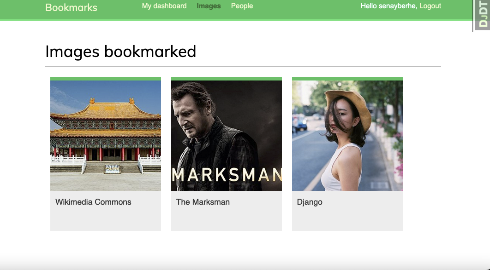
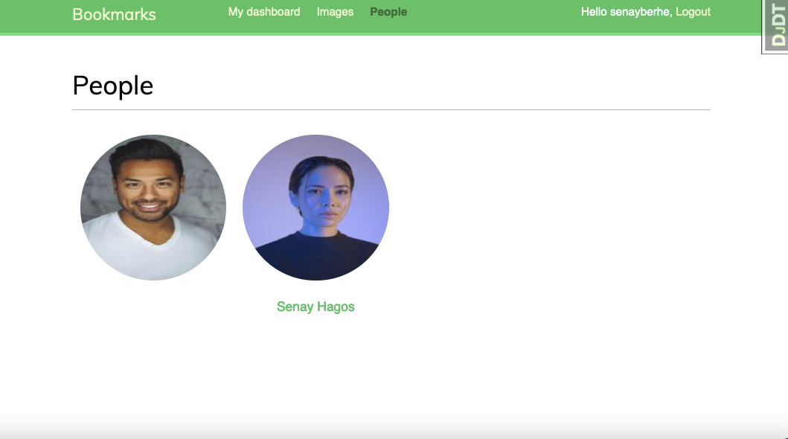

Social Network
Overview

This is a web application built with Django that allows users to create profiles, connect with friends, and share posts. The app uses Ajax for dynamic updates and social authentication to allow users to sign in with their social media accounts.

Some of the features of Django Social Network include:

    User registration and login
    Social network authentication (Facebook, Twitter, etc.)
    User profiles with profile pictures and descriptions
    News feed with posts from users the user is following
    Ability to post status updates, images, and links
    Like and comment on posts
    Follow and unfollow other users

Getting Started

To get started with Django Social Network, follow these steps:

    Clone the repository to your local machine:

bash

git clone https://github.com/senayberhe/django-social-network.git

    Create a virtual environment and activate it:

bash

sh

    export SECRET_KEY='your-secret-key'
    export DEBUG='True'
    export SOCIAL_AUTH_FACEBOOK_KEY='your-facebook-app-id'
    export SOCIAL_AUTH_FACEBOOK_SECRET='your-facebook-app-secret'

python -m venv env
source env/bin/activate

    Install the dependencies:

pip install -r requirements.txt

    Set up the database:

python manage.py migrate

    Create a superuser:

python manage.py createsuperuser

    Start the development server:

python manage.py runserver

    Navigate to http://localhost:8000 in your web browser to view the application.

Screenshots

Here are some screenshots of the application:

DashBoard 

Bookmarks

Profiles

