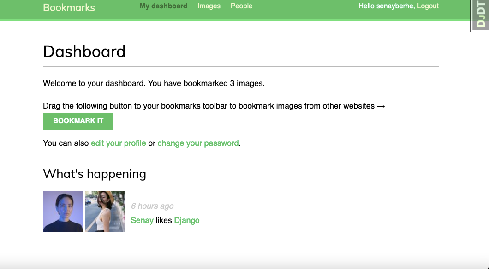

# Social-Network

    A website for bookmarking and sharing images was created using Python and the Django Web Framework.
    Social authentication was implemented with Facebook, Twitter, and Google.
    User profiles were created and image thumbnails were generated.
    A bookmarklet was built using JavaScript and Django.
    A user activity stream was created and AJAX requests were implemented using JavaScript and Django.
    A user follow system was developed and Django signals were used.
    Infinite scroll pagination was implemented and an image ranking system was built using Redis.





    Implement authentication using the Django authentication framework
    Extend the user model with a custom profile model
    Use the Diango messages framework
    Build a custom authentication backend
    Implement social authentication (OAuth2) with Facebook, Twitter, and Google using Python Social Auth
    Use django-extensions to run the development server through HTTPS
    Generate image thumbnails with easy-thumbnails
    Implement many-to-many relationships in models
    Build a JavaScript bookmarklet with JavaScript and Django
    Add asynchronous HTTP requests with the JavaScript Fetch API and Django
    Implement infinite scroll pagination
    Build a user follow system
    Create a user activity stream and optimize QuerySets
    Learn to use Django signals
    Use django-debug-toolbar to obtain relevant debug information
    Count image views with Redis
    Build an image ranking with Redis


[0]: https://www.python.org/
[1]: https://www.djangoproject.com/

# Local Installation

Git clone to a local directory:

```
git clone https://github.com/senayberhe/social-network
```

[Install pipenv system-wide or locally](https://docs.pipenv.org/) but outside a virtualenv. Alternatively, follow these commands:

```
$ pip install -U pip
$ pip install pipenv
```

Now go to the project directory and install the dependencies:
```
$ cd social-Network
$ pipenv install 
```

Now you need to enter the pipenv shell:

```
$ pipenv shell
```

Run the project:
```
$ cd src
$ python manage.py migrate
$ python manage.py loaddata initial-fixture.json
$ python manage.py runserver
```

Open your browser and visit http://127.0.0.1:8000/ (or the URL shown in the last command). If you performed loaddata, then you can login using the username: "admin" and password: "admin".

# Deployment to Heroku

Enter project root and run the following commands:

```
$ heroku create social-Network-demo
$ heroku addons:create heroku-postgresql:hobby-dev
$ heroku config:set DJANGO_SETTINGS_MODULE=supernetwork.settings.production
$ git push heroku master
```
