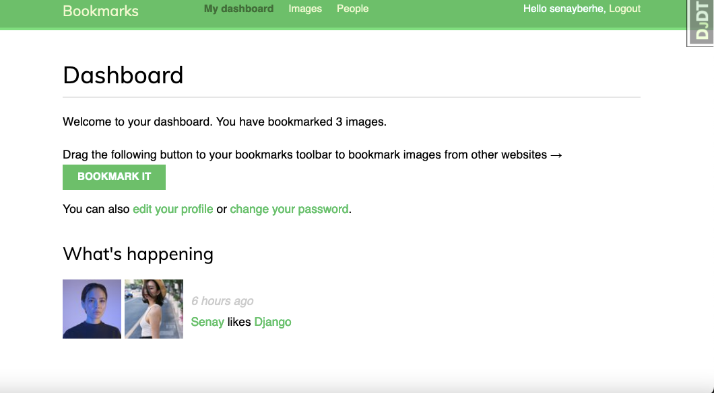

Social Network

Implemented social authentication with Facebook, Twitter, and Google to enable users to sign up and log in to the website with their social media accounts, created user profiles to allow users to add and manage their personal information, generated image thumbnails to display images in a smaller size, reducing loading time, built a bookmarklet with JavaScript and Django to enable users to save content from other websites, created a user activity stream to show the latest activities and updates from other users they follow, implemented AJAX requests with JS and Django to allow users to interact with the website without the need to refresh the page, developed a user follow system to enable users to follow other users and get updates on their activities, learned to use Django signals to implement custom actions and notifications triggered by certain events, implemented infinite scroll pagination to load more content as the user scrolls down the page, and built an image ranking with Redis to allow users to rate and rank images on the website based on popularity and engagement.

Some of the features of Django Social Network include:

     Set up user authentication using Django authentication framework and build a custom authentication backend.
    Use a custom profile model to extend the user model.
    Utilize Django messages framework for displaying messages to the user.
    Implement social authentication with OAuth2 using Python Social Auth and support Facebook, Twitter, and Google.
    Use Django-extensions to run the development server through HTTPS.
    Generate image thumbnails using easy-thumbnails.
    Implement many-to-many relationships in models.
    Create a JavaScript bookmarklet with JavaScript and Django, and add asynchronous HTTP requests with the JavaScript Fetch API and Django.
    Implement infinite scroll pagination and a user follow system.
    Build a user activity stream, optimize QuerySets, and use Django signals.
    Use django-debug-toolbar to obtain debug information, count image views and build an image ranking using Redis.

Getting Started

To get started with Django Social Network, follow these steps:

    Clone the repository to your local machine:

bash

git clone https://github.com/senayberhe/django-social-network.git

    Create a virtual environment and activate it:

bash

sh

    export SECRET_KEY='your-secret-key'
    export DEBUG='True'
    export SOCIAL_AUTH_FACEBOOK_KEY='your-facebook-app-id'
    export SOCIAL_AUTH_FACEBOOK_SECRET='your-facebook-app-secret'

python -m venv env
source env/bin/activate

    Install the dependencies:

pip install -r requirements.txt

    Set up the database:

python manage.py migrate

    Create a superuser:

python manage.py createsuperuser

    Start the development server:

python manage.py runserver

    Navigate to http://localhost:8000 in your web browser to view the application.

Screenshots

Here are some screenshots of the application:

DashBoard 

Bookmarks

Profiles

